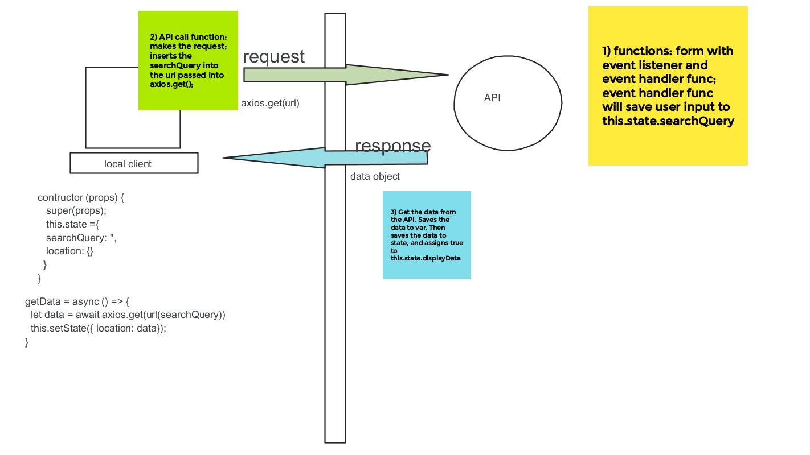
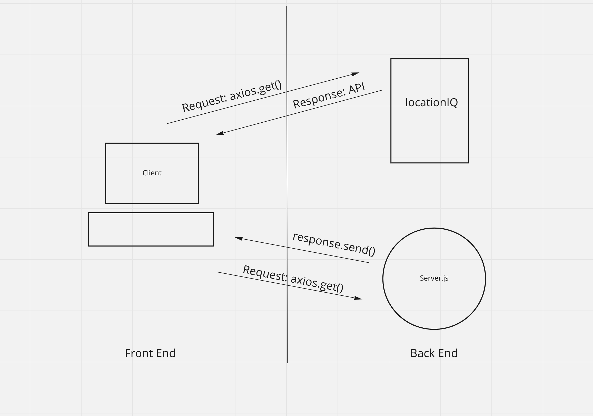
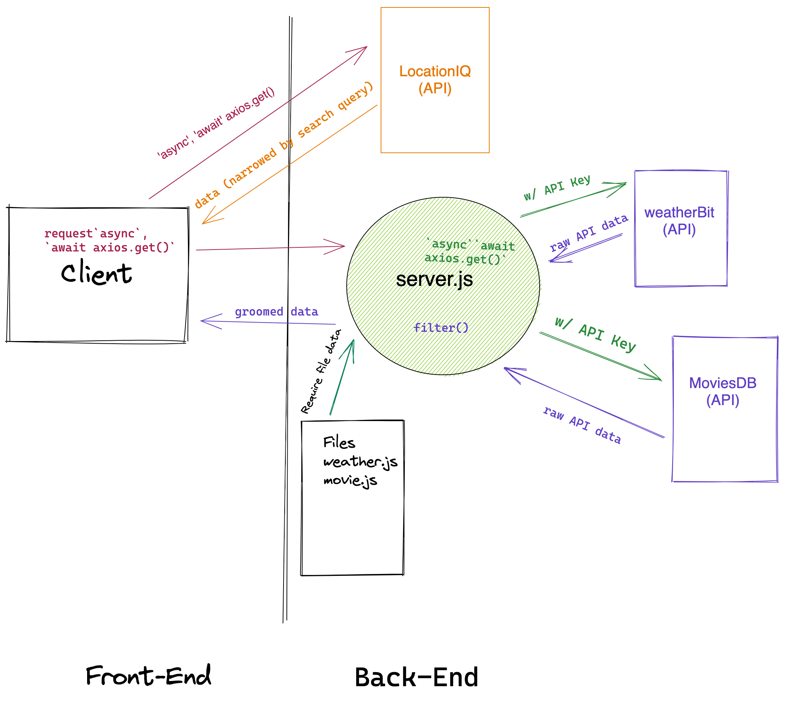
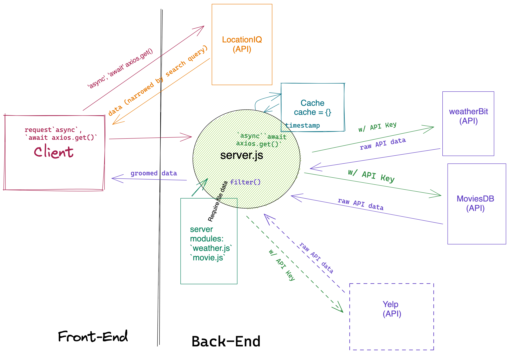

# City Explorer

**Author**: Joshua McCluskey
**Version**: 1.0.0 (increment the patch/fix version number if you make more commits past your first submission)

## Overview

Application is your own virtual guide to any city in the world.

## Getting Started

### [City Explorer Website](https://city-explorer-joshuamccluskey.netlify.app/)

## Architecture

git

- HTML5
- CSS3
- JavaScript
- React
- Bootstrap
- Axios
- LocationIQ API
- Netlify

### [Trello](https://trello.com/b/V7StKRPp/city-explorer)

### [PR Lab06](https://github.com/joshuamccluskey/city-explorer/pull/1/commits)

## Change Log

- 01.17.2021 6:00 PM PST - Repo created deployment bug fixed in package.json file
- 01.17.2021 11:00 PM PST - Setup LocationIQ API, states, and functions
- 01.17.2021 11:15 PM PST - Map Rendered in Bootstrap Card
- 01.18.2021 01:00 AM PST - CSS Styling and Error Message Complete
- 01.19.2021 05:24 PM PST - Debugged and Finish Card 2 and 3
- 01.20.2021 05:30 PM PST - Updates for lab 07
- 01.21.2021 02:30 PM PST - Lab08 Complete Deployment on Heroku
- 01.21.2021 02:30 PM PST - Lab09 Code Base Refactored

## Credit and Collaborations

- Credit: Kevin Lamarca on collaboration on WRRC Design
- Credit: Regan Hayes on Collaboration on WRRC Server Diagram
- Credit: Chuck Altopiedi on Collaboration on WRRC API Diagram
- Credit: Brian Thornburg on Collaboration on WRRC Require Diagram
- Credit: Robb Alexander and Brian Thornburg on WRRC Cache Diagram

### Name of feature: 1 Setup Repo and API

Estimate of time needed to complete: 30 minutes

Start time: 5:00 PM PST

Finish time: 6:00 PM PST

Actual time needed to complete: 1 hour

#### Name of feature: 2 Locations

Estimate of time needed to complete: 1 Hour

Start time: 9:00 PM PST

Finish time: 11:00 PM PST

Actual time needed to complete: 2 hours

### Name of feature: 3 Map

Estimate of time needed to complete: 30 minutes

Start time: 11:00 PM PST

Finish time: 11:15 PM PST

Actual time needed to complete: 15 minutes

Estimate of time needed to complete: 30 minutes

### Name of feature: Styling and 4 Error Message

Estimate of time needed to complete: 1 hour

Start time: 11:15 PM PST

Finish time: 1:00 AM PST

Actual time needed to complete: 1.75 hours

### Name of feature: Card 2 Weather Placeholder

Estimate of time needed to complete: 1 hour

Start time: 8:00 PM PST

Finish time: 10:00 PM PST

Actual time needed to complete: 2 Hours

### Name of feature: Card 2 Weather Placeholder Card 3 Error Handeling

Estimate of time needed to complete: 1 hour

Start time: 4:15 PM PST

Finish time: 5:30 PM PST

Actual time needed to complete: 1.25 hours

### Lab 07 Updates

Estimate of time needed to complete: 1 hour

Start time: 4:15 PM PST

Finish time: 5:30 PM PST

Actual time needed to complete: 1.25 hours

### Lab08 API Card 1

Estimate of time needed to complete: 1 hour

Start time: 9:30 PM PST

Finish time: 12:30 PM PST

Actual time needed to complete: 3 hours

### Lab08 Complete

Estimate of time needed to complete: 3 hour

Start time: 9:30 PM PST

Finish time: 12:30 PM PST

Actual time needed to complete: 3 hours

### Lab09

Estimate of time needed to complete: 2 hour

Start time: 8:30 PM PST

Finish time: 10:00 PM PST

Actual time needed to complete: 2.5 hours

### Lab10

Estimate of time needed to complete: 2 hour

Start time: 2:00 AM PST

Finish time: 3:00 AM PST

Actual time needed to complete: 1 hours
